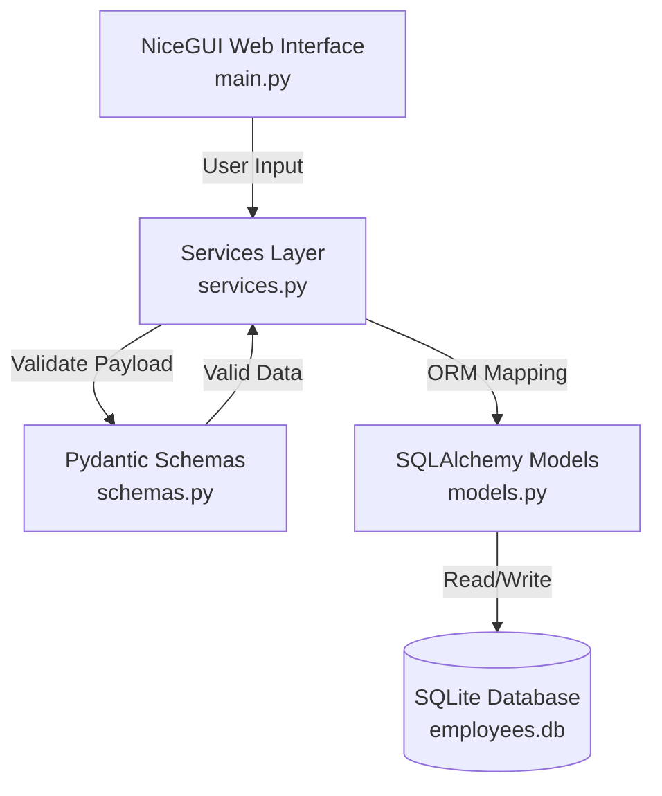
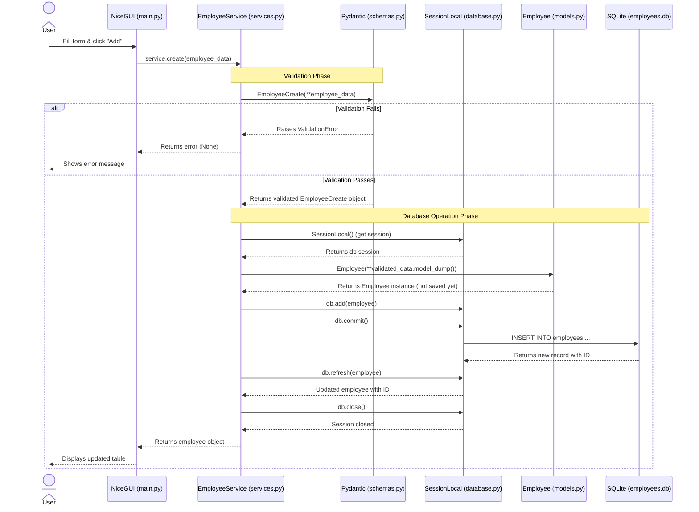

# System Architecture: Employee Management System

This document outlines the internal architecture of the application, the chosen technology stack, and the data flow principles.

---

## 1. Technology Stack

* NiceGUI — web UI framework (Python-native, no HTML/CSS needed)

* SQLAlchemy + SQLite — utilized for ORM and database management. SQLite ensures deployment simplicity (local file storage), while SQLAlchemy provides a robust, object-oriented approach to database interactions.

* Pydantic — implemented for strict data validation at the backend level before any database transactions occur.

* Pytest — testing framework used to ensure the reliability of the business logic and database operations.

---

## 2. Project Structure

```
Employee_management_system/
├── README.md # Project description
├── requirements.txt # Dependencies
├── .gitignore # Git ignore rules
├── .github/
│  └── workflows/
│   └── ci.yml # CI/CD pipeline (GitHub Actions)
│
├── src/
│ └── management_system/
│ ├── __init__.py
│ ├── main.py # NiceGUI UI entry point
│ ├── database.py # DB connection, session management
│ ├── models.py # SQLAlchemy table definitions
│ ├── schemas.py # Pydantic validation schemas
│ └── services.py # CRUD operations
│
├── tests/
│ ├── __init__.py
│ ├── test_main.py
│ ├── conftest.py # Pytest fixtures & configuration
│ ├── test_schemas.py # Validation tests
│ └── test_services.py # CRUD logic tests
│
├── docs/
│ ├── API.md
│ ├── ARCHITECTURE.md # This document
│ ├── INSTALL.md
│ └── README.md
│
├── .pylintrc # Pylint configuration
└── pytest.ini # Pytest configuration
```

--- 

## 3. Architecture Diagrams 





## 4. Project Structure & Data Flow

The application is divided into logical modules to maintain separation of concerns:

* `database.py` — connection setup, engine, and session management.

* `models.py` — SQLAlchemy table definitions.

* `schemas.py` — Pydantic schemas for data validation.

* `services.py` (CRUD) — core business logic functions (Create, Read, Update, Delete) isolated from the UI layer.

* `main.py` — application entry point, NiceGUI initialization, and UI rendering.

* `tests/` — directory containing Pytest unit tests for backend logic.

---

The user submits data via the web form (NiceGUI).

The payload is routed to the business logic layer (`services.py`).

Data is passed through Pydantic schemas (`schemas.py`) for validation. If validation fails, an exception is raised, and the transaction is aborted.

If valid, SQLAlchemy maps the data to an object and commits the SQL transaction to the SQLite database.

The updated employee record is retrieved from the database and rendered back to the UI table.
