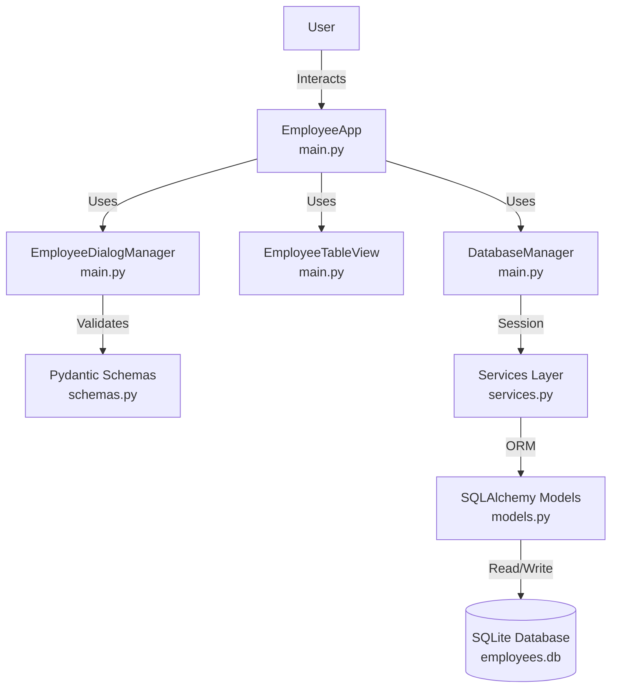
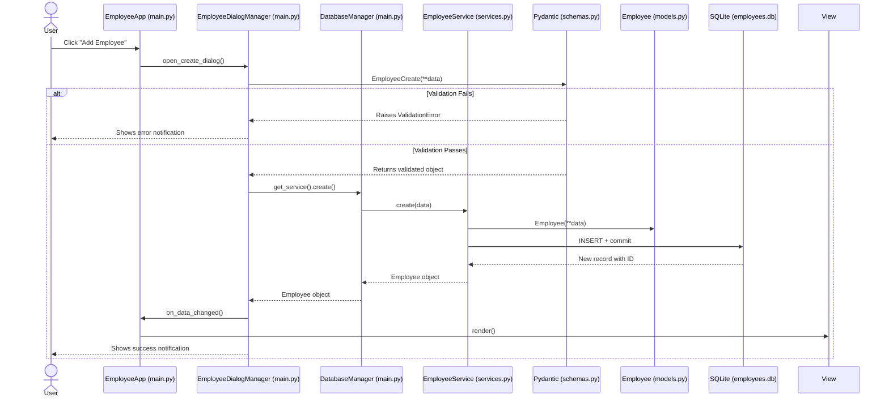

# System Architecture: Employee Management System

This document outlines the internal architecture of the application, its module structure, and the data flow principles.

## 1. Project Structure

```
Employee_management_system/
├── README.md # Project description
├── requirements.txt # Dependencies
├── .gitignore # Git ignore rules
├── .github/
│  └── workflows/
│      └── ci.yml # CI/CD pipeline (GitHub Actions)
│
├── src/
│ └── management_system/
│ ├── __init__.py
│ ├── constants.py # Application constants (currencies, timezones)
│ ├── database.py # DB connection, session management
│ ├── main.py # NiceGUI UI entry point
│ ├── models.py # SQLAlchemy table definitions
│ ├── schemas.py # Pydantic validation schemas
│ └── services.py # CRUD operations
│
├── tests/
│ ├── __init__.py
│ ├── conftest.py # Pytest fixtures & configuration
│ ├── test_gui.py # GUI tests
│ ├── test_schemas.py # Validation tests
│ └── test_services.py # CRUD logic tests
│
├── docs/
│ ├── API.md
│ ├── ARCHITECTURE.md # This document
│ ├── INSTALL.md
│ └── README.md
│
├── .pylintrc # Pylint configuration
└── pytest.ini # Pytest configuration
```

The application is divided into logical modules to maintain separation of concerns:

* `database.py` — handles connection setup, engine creation, and SessionLocal management.
* `constants.py` — application-wide constants (currency codes, timezone options, default values).
* `models.py` — contains SQLAlchemy table definitions. 
  * `Class Employee`: maps to the `employees` table and defines the data schema (id, full_name, birth_date, hire_date, position, salary, currency, timezone).
* `schemas.py` — contains Pydantic schemas for data validation. 
  * `Class EmployeeCreate`: validates payload before inserting into the database (full_name ≥ 2 words, salary ≥ 0, currency 3 chars).
  * `Class EmployeeRead`: defines the structure of data returned to the UI (includes `id`, uses `from_attributes=True`).
* `services.py` — contains core business logic functions (Create, Read, Update, Delete) isolated from the UI layer.
  * `Class EmployeeService`: CRUD operations with Session management (add, commit, refresh, close).
* `main.py` — application entry point with separated components:
  * `Class DatabaseManager`: manages database connections and session lifecycle
  * `Class EmployeeTableView`: renders the employee table with CRUD buttons
  * `Class EmployeeDialogManager`: handles create, edit, and delete dialogs
  * `Class EmployeeApp`: orchestrates all components and builds the UI
* `tests/` — directory containing Pytest unit tests for backend logic and GUI components.

---

## 2. Architecture Diagrams 

### System Components Diagram



### Data Flow Sequence Diagram



---

## 3. Components Interaction & Data Flow

1. User interacts with the UI through `EmployeeApp` which delegates to `EmployeeDialogManager` for forms.

2. Data is validated through Pydantic schemas (`schemas.py`) inside `EmployeeDialogManager`. 
   If validation fails, a `ValidationError` is caught and shown as a notification.

3. If validation passes, `EmployeeDialogManager` calls `DatabaseManager.get_service()` to access `EmployeeService`.

4. The service maps data to SQLAlchemy model (`models.Employee`) and persists via database session (`database.py`).

5. On success, `EmployeeDialogManager` triggers `on_data_changed()` callback, which calls `EmployeeTableView.render()` 
   to refresh the displayed employee list.

---

## 4. Component Responsibilities

| Component | Responsibility |
|-----------|---------------|
| `DatabaseManager` | Session lifecycle, connection initialization, service access |
| `EmployeeTableView` | Render employee list, handle empty state, display CRUD buttons |
| `EmployeeDialogManager` | Open/close dialogs, form validation, notify user |
| `EmployeeApp` | Orchestrate components, build UI layout, handle callbacks |

### Component Interaction Flow

```mermaid
sequenceDiagram
    participant App as EmployeeApp
    participant DB as DatabaseManager
    participant View as EmployeeTableView
    participant Dlg as EmployeeDialogManager
    participant SVC as EmployeeService
    
    App->>DB: initialize_db()
    App->>View: render()
    View->>DB: get_service().get_all()
    DB->>SVC: get_all()
    SVC-->>View: employees list
    View-->>App: table rendered
    
    User->>App: Click "Add Employee"
    App->>Dlg: open_create_dialog()
    Dlg->>DB: get_service().create()
    DB->>SVC: create(data)
    SVC-->>Dlg: success
    Dlg->>App: on_data_changed()
    App->>View: render()
